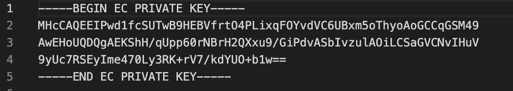
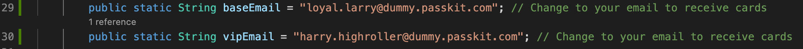
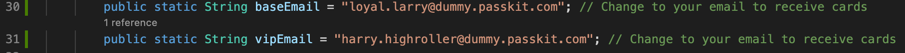
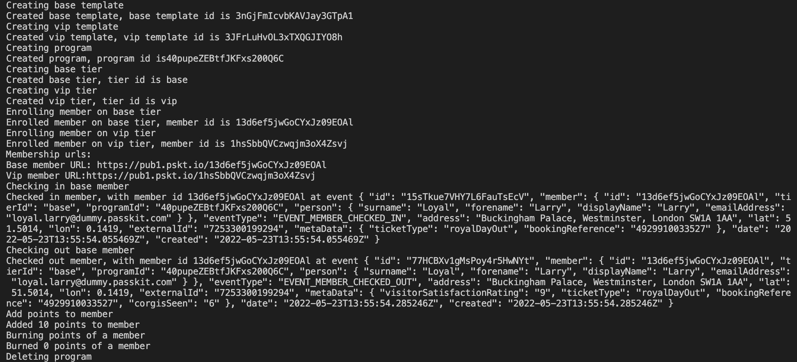
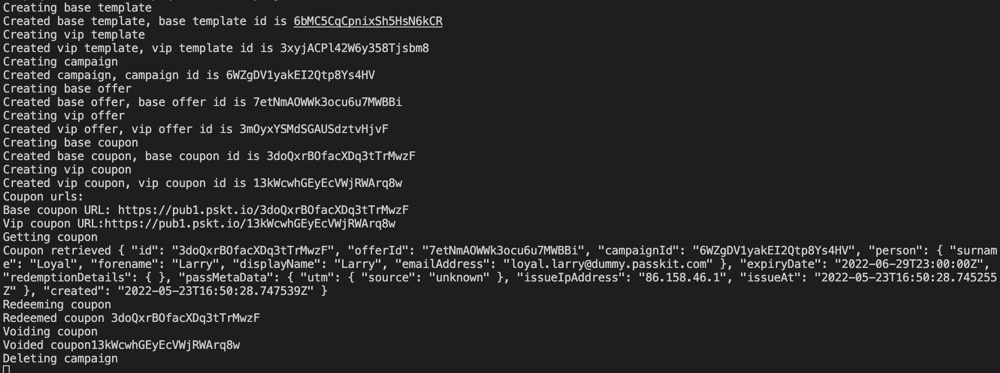
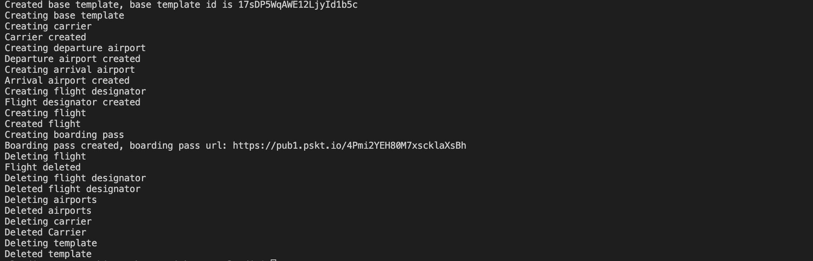

PassKit C# Quickstart
=======================

### Overview

This quickstart aims to help  get C# developers up and running with the PassKit SDK as quickly as possible.

### Prerequisites

You will need the following:

- A PassKit account (signup for free at [PassKit](https://app.passkit.com))
- Your PassKit SDK Credentials (available from the [Developer Tools Page](https://app.passkit.com/app/account/developer-tools))
- Apple wallet certificate id (for flights only, available from the [certificate page](https://app.passkit.com/app/account/certificates))
 

 ### Configuration

1. In the certs folder of the repository add the following three PassKit credential files:
    - certificate.pem
    - ca-chain.pem
    - key.pem
    
    You can disregard the key-java.pem credentials file as it is not compatible with C#.

2. Now we need to decrypt your `key.pem`. At your project root directory, run `cd ./certs`  `openssl ec -in key.pem -out key.pem`. Your `key.pem` file should look like below.
   
   If you do not see `Proc-Type: 4,ENCEYPTED` on line 2, you have successfully decrypted `key.pem`.

3. If you wish to receive enrollment emails for loyalty or coupon cards edit `baseEmail` and `vipEmail` on lines 29 and 30 in QuickstartLoyalty for loyalty,
    
    and lines 30 and 31 in QuickstartCoupons for coupons.
    

4. Go back to root directory with `cd ../..`. Then run `dotnet run`, to create a sample membership card, coupon card and boarding pass (with default templates & tiers/offers) and issue them.

## Examples
###  Membership Cards
QuickstartLoyalty will create a membership program with 2 tiers, base and VIP.  It will enrol two members, one in each tier.
It contains the methods:
- createProgram() - takes a new program name and creates a new program
- createTier() - takes the programId of the program just created in the above program, creates a new template (based of default template), creates a tier, and links this tier to the program
- enrolMember() - takes programId and tierId created by the above methods, and memberDetails, creates a new member record, and sends a welcome email to deliver membership card url 
- checkInMember() - an optional method that checks in a member at an event
- checkOutMember() - an optional method that checks out a member at an event
- addPoints() - an optional method that takes the memberId of existing member to add points to chosen member
- burnPoints() - an optional method that burns the selected number of points of a chosen member
- deleteProgram() -  an optional method that deletes a program and any tiers or members associated with it.

After running `dotnet run` the terminal should show:

###  Coupons
QuickstartCoupons will create a campaign with 2 offers, base and VIP. It will create two coupons, one in each offer. It will then redeem one of the coupons.
It contains the methods:
- createCampaign() - takes a new campaign name and creates a new campaign
- createOffer() - takes a campaignId of the campaign you just created and creates a new template (based of default template), creates an offer, and links this offer to the campaign
- createCoupon() - takes campaignId and offerId created by the above methods, and couponDetails, creates a new coupon record, and sends a welcome email to deliver coupon card url
- getSingleCoupon() - an optional method that takes couponId and returns the record of that coupon
- redeemCoupon() - an optional method that redeems a coupon that has been made
- voidCoupon() - an optional method that voids a coupon that has been made
- deleteCampaign() - an optional method that deletes a campaign and any associated offers or coupons

After running `dotnet run` the terminal should show:

### Boarding Passes
QuickstartFlights will create a carrier, flight, an arrival airport, a departure airport, flight designator and boarding pass for one person. 
It contains the methods:
- createTemplate() - creates the pass template for flights and boarding passes
- createCarrier() - takes a new carrier code and creates a new carrier
- createAirports() - takes a new airport code and creates a new airport
- createFlight() - takes templateId , from previous method, to use as base template and uses a carrier code, created from previous method, and creates a new flight
- createFlightDesignator() - creates flight designator using flight code
- createBoardingPass() - takes templateId, from previous method, and customer details creates a new boarding pass, and sends a welcome email to deliver boarding pass url
- deleteFlightAssets() - an optional method that deletes the flight objects recently created

After running `dotnet run` the terminal should show:

## Documentation
* [PassKit Membership Official Documentation](https://docs.passkit.io/protocols/member)
* [PassKit Coupons Official Documentation](https://docs.passkit.io/protocols/coupon)
* [PassKit Boarding Passes Official Documentation](https://docs.passkit.io/protocols/boarding)

## Getting Help
* Email [support@passkit.com](email:support@passkit.com)
* [Online chat support](https://passkit.com/)

